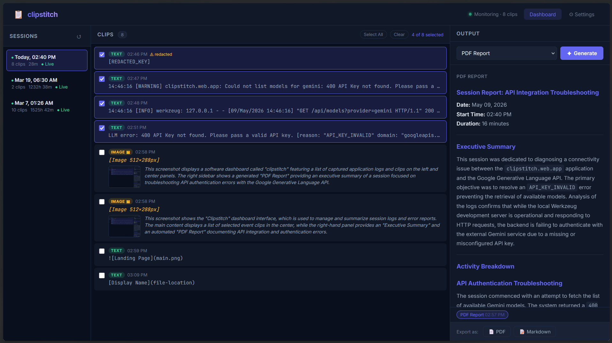

# clipstitch — AI-Powered Clipboard Narrative Generator

> **Turn your clipboard fragments into structured narratives.**  
> A Windows desktop utility that silently watches what you copy, stores everything locally, and uses AI to stitch your clipboard history into coherent work logs, research digests, progress emails, PDF reports, and more — with zero extra effort.



To see the full report generated by ClipStitch, see the file below.
Full Report: [Report.md](report.md)

## 🎯 The Idea

Knowledge workers copy dozens of things every day: code snippets, Stack Overflow answers, API responses, CVE references, log entries, URLs, research findings, meeting notes. Each fragment is useful in the moment but loses context minutes later. **clipstitch captures this passive behavior and transforms it into structured, exportable intelligence.**

You don't have to change your workflow. Just copy as usual. When you're ready, open the dashboard, select the clips you want, click a button, and let AI turn them into a polished narrative.

### Perfect For:
- 💼 **Knowledge Workers** — Generate daily work summaries and progress emails automatically
- 👨‍💻 **Developers** — Create end-of-day standups and project logs from your research trail
- 🔍 **Security Analysts & Penetration Testers** — Turn engagement notes into professional incident reports and pentest walkthroughs
- 📚 **Researchers & Writers** — Synthesize research findings into structured digests and citations
- 👤 **Technical Support** — Build customer issue summaries from diagnostic output

---

## ✨ Key Features

### 🗂️ **Silent Clipboard Monitoring**
- Event-driven Win32 clipboard listener — zero CPU overhead
- Automatic type detection (URL, code, text, image)
- Duplicate detection and redaction of sensitive credentials (passwords, API keys, tokens)

### 🕐 **Intelligent Session Grouping**
- Automatic session detection based on configurable idle time
- Smart resume detection for quick returns (no false session breaks)
- Clear visual separation of work blocks

### 🤖 **AI-Powered Generation**
Multiple output modes powered by your choice of LLM:
- **Work Log** — Bullet-point daily summary
- **Research Digest** — Synthesized findings with sources
- **Progress Email** — Polished narrative for status updates
- **PDF Report** — Professional document with cover, timeline, and summary
- **Custom Prompts** — Define your own generation templates

Supports:
- 🌐 **OpenAI** (ChatGPT, GPT-4)
- 🔵 **Google Gemini**
- 💻 **Local Ollama** (Llama, Mistral, etc. — no API key required)

### 📄 **Export Formats**
- **PDF** — Styled reports with cover page, clip timeline, and AI summary
- **Markdown** — Drop into Obsidian, Notion, or any knowledge base
- **Plain Text** — Simple, portable format

### 🎛️ **Granular Privacy Controls**
- Toggle email, password, and API key redaction independently
- All data stored locally in SQLite — nothing leaves your computer unless you export
- Configurable via GUI settings panel

### 🖥️ **System Tray & Hotkeys**
- Runs silently in background as tray icon
- Global hotkey (Ctrl+Shift+S) to open dashboard from anywhere
- Pause/resume monitoring without closing the app

### 🔒 **Security First**
- Automatic credential redaction before storage
- All data stored locally
- No telemetry, no cloud sync
- Optional per-clip visibility controls

---

## 🛠️ Tech Stack

| Component | Technology | Reason |
|-----------|-----------|--------|
| **Language** | Python 3.10+ | Rich LLM SDK support, cross-platform |
| **Clipboard** | `pywin32` (Win32 API) | Event-driven, instant, zero CPU waste |
| **Database** | SQLite3 (stdlib) | Zero-config local storage, no server |
| **LLM Integration** | OpenAI / Google Generative AI / Ollama SDKs | Direct APIs, no heavy abstraction layers |
| **Web UI** | Flask + Vanilla HTML/CSS/JS | Lightweight, no build step required |
| **PDF Export** | `reportlab` | Full layout control |
| **Tray Icon** | `pystray` + Pillow | Native Windows integration |
| **Configuration** | JSON + `.env` | Settings UI + secure API key storage |
| **Distribution** | PyInstaller | Single `.exe` file for end users |

---

## 📦 Installation

### Prerequisites
- **Windows 10/11**
- **Python 3.10+** (or download the pre-built `.exe` from Releases)
- One LLM provider:
  - OpenAI API key (ChatGPT, GPT-4)
  - Google Gemini API key
  - Ollama running locally (`http://localhost:11434`)

### From Source

1. **Clone the repository:**
   ```bash
   git clone https://github.com/yourusername/clipstory.git
   cd clipstory
   ```

2. **Create a virtual environment:**
   ```bash
   python -m venv venv
   venv\Scripts\activate
   ```

3. **Install dependencies:**
   ```bash
   pip install -r requirements.txt
   ```

4. **Set up environment variables:**
   ```bash
   copy .env.example .env
   # Edit .env and add your API keys (see below)
   ```

5. **Configure settings (optional):**
   ```bash
   # Default config.json is pre-configured; edit to customize
   ```

6. **Run the app:**
   ```bash
   python -m clipstitch.main
   ```

### From Pre-Built Executable
Download the latest `.exe` from [Releases](https://github.com/yourusername/clipstory/releases) and run it.

---

## 🔧 Configuration

### Environment Variables (`.env`)
Create a `.env` file in the project root for API keys:

```env
# OpenAI
OPENAI_API_KEY=sk-...

# Google Gemini
GEMINI_API_KEY=...

# Ollama (local — no key needed)
# OLLAMA_HOST=http://localhost:11434
```

**Or use the Settings UI** — Open the dashboard and go to **Settings > LLM Provider** to enter your API keys directly. They'll be saved securely in your local configuration.

### Settings (`config.json`)
Edit `config.json` to customize behavior:

```json
{
  "llm": {
    "provider": "gemini",           // "openai", "gemini", or "ollama"
    "model": "gemini-2.5-flash",    // Model name for the provider
    "openai_api_key": "",           // or set via Settings UI
    "gemini_api_key": "",           // or set via Settings UI
    "ollama_host": "http://localhost:11434",
    "ollama_model": "llama3.1:8b"
  },
  "monitor": {
    "session_gap_minutes": 30,      // Minutes of inactivity to end a session
    "dedup_window": 5,              // Seconds to consider clips as duplicates
    "vision_describe": true         // Describe images using vision model
  },
  "privacy": {
    "redact_api_keys": true,
    "redact_passwords": true,
    "redact_emails": false
  },
  "web": {
    "port": 5050,                   // Web UI port
    "open_on_start": false
  },
  "hotkeys": {
    "open_dashboard": "ctrl+shift+s",
    "quick_generate": "ctrl+shift+g"
  }
}
```

---

## 🚀 Usage

### 1. Start the App
```bash
python -m clipstitch.main
```
You'll see a tray icon appear. The web dashboard runs at `http://localhost:5050`.

### 2. Copy Normally
Go about your work. The app silently captures everything you copy in the background.

### 3. Open Dashboard
- **Hotkey:** Press `Ctrl+Shift+S` (or your configured hotkey)
- **Tray Icon:** Right-click the tray icon → "Open Dashboard"

### 4. Review Clips
The dashboard shows your clips organized by session, type, and timestamp. You can:
- View each clip
- Mark clips as sensitive (hide from export)
- Search by content or timestamp

### 5. Generate & Export
1. **Select clips** (or leave all selected to use the whole session)
2. **Choose a generation mode:**
   - Work Log
   - Research Digest
   - Progress Email
   - PDF Report
   - Custom
3. **Click Generate** — AI will create the output in seconds
4. **Edit** the result if needed
5. **Export** as PDF, Markdown, or copy to clipboard

---

## 📋 Project Structure

```
clipstory/
├── README.md
├── requirements.txt
├── config.json
├── .env.example
│
├── clipstitch/              # Main package
│   ├── main.py              # Entry point
│   ├── config.py            # Configuration loader
│   │
│   ├── monitor/             # Clipboard monitoring
│   │   ├── clipboard.py     # Win32 event listener
│   │   ├── session.py       # Session detection
│   │   └── image.py         # Image handling
│   │
│   ├── db/                  # Local database
│   │   ├── schema.sql       # SQLite schema
│   │   └── store.py         # CRUD operations
│   │
│   ├── llm/                 # LLM integration
│   │   ├── provider.py      # Provider abstraction
│   │   ├── prompts.py       # Prompt templates
│   │   └── generator.py     # Generation orchestration
│   │
│   ├── export/              # Export formats
│   │   ├── pdf.py           # PDF generation
│   │   └── markdown.py      # Markdown export
│   │
│   ├── web/                 # Web UI
│   │   ├── app.py           # Flask app
│   │   ├── templates/       # HTML
│   │   └── static/          # CSS, JS
│   │
│   └── tray/                # System tray
│       └── icon.py          # Tray menu & hotkeys
│
├── assets/                  # Icons, images
├── tests/                   # Unit tests
└── thumbnails/             # Image cache
```

---

## 🔐 Privacy & Security

- ✅ **Local-first**: All data stored in local SQLite database
- ✅ **No cloud sync**: Nothing leaves your computer unless you manually export
- ✅ **Automatic redaction**: Passwords, API keys, and tokens redacted before storage
- ✅ **Configurable**: Granular privacy controls for each redaction type
- ✅ **No telemetry**: Zero tracking, no analytics, no third-party connections (except your chosen LLM API)

---

## 🧪 Testing

Run the test suite:
```bash
pytest tests/
```

Tests cover:
- Clipboard monitoring and deduplication
- Session detection logic
- Database CRUD operations
- Prompt generation and LLM integration
- PDF and Markdown export

---

## 🤝 Contributing

Contributions welcome! Please:
1. Fork the repository
2. Create a feature branch (`git checkout -b feature/amazing-feature`)
3. Commit your changes (`git commit -m 'Add amazing feature'`)
4. Push to the branch (`git push origin feature/amazing-feature`)
5. Open a Pull Request

### Development Setup
```bash
# Install dev dependencies
pip install -r requirements.txt
pip install pytest pytest-cov black flake8

# Format code
black clipstitch/ tests/

# Lint
flake8 clipstitch/ tests/

# Test
pytest tests/ -v --cov=clipstitch
```

---

## 📝 License

This project is licensed under the [MIT License](LICENSE) — feel free to use, modify, and distribute.

---

## 💬 Use Cases & Examples

### 📊 Analyst Workflow
*A security analyst running a penetration test:*
1. All day, they copy commands, outputs, log snippets, CVE references, and findings
2. At the end of the engagement, they open clipstitch
3. They generate a "PDF Report" → professional incident report with timeline
4. Export as PDF and include in the client deliverable

### 📧 Manager Workflow
*A manager needs to send a weekly standup:*
1. Throughout the day, they copy project updates, feature announcements, blockers
2. At EOD, they press `Ctrl+Shift+S`
3. They select clips from the past 2 days
4. They click "Progress Email"
5. AI generates a polished status update → they copy it to Outlook

### 🔬 Researcher Workflow
*A researcher reading 20+ papers on a topic:*
1. They copy key findings, URLs, citations, and quotes throughout the day
2. They want to send a research summary to their advisor
3. They select the clips and click "Research Digest"
4. AI synthesizes everything into a structured summary with sources
5. They export as Markdown and save to their knowledge base

---

## 🐛 Troubleshooting

**Q: App won't start**
- Ensure Python 3.10+ is installed
- Check that all dependencies are installed: `pip install -r requirements.txt`
- Look at `clipstitch.log` in the project directory

**Q: "No module named pywin32"**
- Run `pip install pywin32` and then `python -m Scripts.pywin32_postinstall -install`

**Q: Clipboard monitoring isn't working**
- This is Windows-only and requires the app to be running
- Check that `config.json` is in the project root

**Q: LLM generation is slow**
- Using a free OpenAI/Gemini tier? Try `ollama` locally instead
- Reduce the number of selected clips

**Q: Where is my data stored?**
- Clips are stored in `clipstitch.db` (SQLite) in the project directory
- Images are cached in the `thumbnails/` directory

---

## 📞 Support

For bugs, feature requests, or questions:
- Open an [Issue](https://github.com/yourusername/clipstory/issues)
- Check [existing issues](https://github.com/yourusername/clipstory/issues) first
- See [features.md](features.md) for planned features and user stories

---

**Made with ❤️ for knowledge workers who are tired of losing their clipboard history.**
